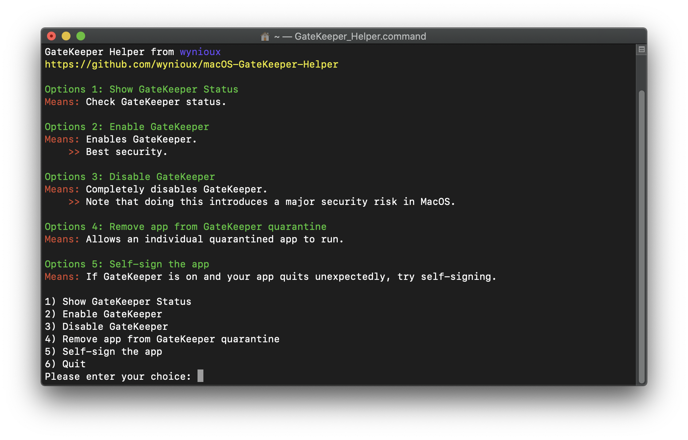

# What is GateKeeper Helper?



This is a simple useful tool for both **Pro** & **Newbie** users which allow you to do the following:

1. Disable Your GateKeeper,
    > You can completely disable your gatekeeper -> Good For Professional Users.

2. Enable Your GateKeeper,
    > You can completely enable your gatekeeper -> Good For Newbie Users.

3. Allow Single App To ByPass The GateKeeper,
    > If you don’t want to completely disable your gatekeeper then allow an individual app to pass it -> Recommended For All Users.

4. Self-Sign An App,
    > If you don’t want to disable SIP and your app is quite unexpectedly especially under the recent macOS then try to Self-Sign your app using this option.

## What is GateKeeper?
```
Gatekeeper is a security feature of the macOS operating system by Apple. It enforces code signing and verifies downloaded applications before allowing them to run.
```

## Why should I use?
```
- To fix "Example-App is damaged and can't opened. You should move it to the Trash." messages.

- To fix "Exaple-App.pkg can't be opened because it is from an unidentified developer." messages.
```

## How to use?
```
Just download "GateKeeper_Helper.command" file and run it.
Note: To open helper for first time, right click on it then click open.
```